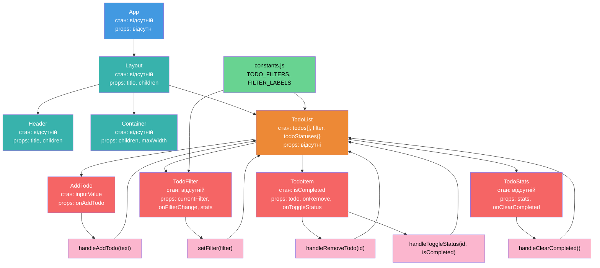

# react_lab3

## Діаграма дерева компонентів та потоку даних

## Опис потоку даних

### Потік Props (Вниз)

1. **App** → **Layout** :
    - `title` - заголовок додатка ("To-Do List")
    - `children` - TodoList компонент
2. **Layout** → **Header/Container** :
    - `title` до Header компонента
    - `children` до Container компонента
    - `maxWidth` (за замовчуванням "md") до Container
3. **TodoList** → **дочірні компоненти** :
    - `onAddTodo` → AddTodo
    - `currentFilter`, `onFilterChange`, `stats` → TodoFilter
    - `todo`, `onRemove`, `onToggleStatus` → TodoItem (для кожного завдання)
    - `stats`, `onClearCompleted` → TodoStats

### Потік Callbacks (Вгору)

1. **AddTodo** → **TodoList** :
    - Викликає `handleAddTodo(text)` при додаванні нового завдання
2. **TodoFilter** → **TodoList** :
    - Викликає `setFilter(filter)` при зміні фільтра
3. **TodoItem** → **TodoList** :
    - Викликає `handleRemoveTodo(id)` при видаленні завдання
    - Викликає `handleToggleStatus(id, isCompleted)` при зміні статусу завдання
4. **TodoStats** → **TodoList** :
    - Викликає `handleClearCompleted()` при очищенні виконаних завдань

### Управління станом (Принцип колокації)

| Компонент      | Стан                                  | Опис                                  |
| :------------- | :------------------------------------ | :------------------------------------ |
| **App**        | Відсутній                             | Кореневий компонент-контейнер         |
| **Layout**     | Відсутній                             | Компонент розмітки сторінки           |
| **Header**     | Відсутній                             | Заголовок додатка                     |
| **Container**  | Відсутній                             | Контейнер з обмеженням ширини         |
| **TodoList**   | `todos[]`, `filter`, `todoStatuses{}` | Центральне управління станом завдань  |
| **AddTodo**    | `inputValue`                          | Локальний стан поля вводу             |
| **TodoFilter** | Відсутній                             | Отримує стан фільтра через props      |
| **TodoItem**   | `isCompleted`                         | Локальний стан завершення завдання    |
| **TodoStats**  | Відсутній                             | Відображає статистику на основі props |
| **constants**  | `TODO_FILTERS`, `FILTER_LABELS`       | Статичні константи для фільтрів       |

### Особливості архітектури

**Подвійне управління станом завершення**:

-   TodoItem має локальний стан `isCompleted` для оновлення UI незалежно
-   TodoList зберігає статуси завдань у `todoStatuses{}` для фільтрації та статистики

**Обчислювані властивості**:

-   Метод `getFilteredTodos()` фільтрує завдання відповідно до активного фільтра (усі, активні, завершені)
-   `stats` — обчислює статистику завдань: загальна кількість, активні та завершені
